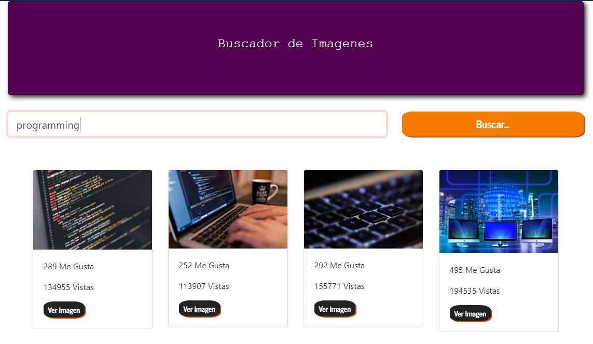

# buscadorImagenes
El sitio es un Spa responsive el cual permite filtrar, descargar imágenes utilizando un buscador y  Consumiendo la API de Pixabay... el mismo se realizo con React, html5,css3 (framework bootstrap) y Nodejs.

       INICIALIZANDO PROJECTO:
 1) Descargar el codigo, clonar el repositorio.
 2) abrir una nueva consola cmd en el caso de windows ubicarse dentro de la carpeta con el projecto.
 3) instalar los modulos de nodejs, ejecutando el comando: npm install
 4) una vez instalados los archivos de punto 3), ejecturar el comando: npm start 
